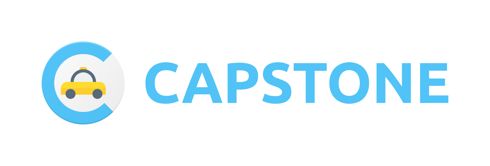

     

# Android Developer Nanodegree Program Scholarship

# Capstone Project

<h1 align=center>

</h1>

Final Project

## Project Overview

In the Capstone project, you will build an app of your own design in two stages.
In Stage 1, you will design and plan the app, using a template that we provide in the "Instructions" node.

Creating and building your own app idea can be both exciting and daunting; ultimately,
we want the experience to be rewarding. You'll apply a wealth of different concepts
and components that you've learned across the Nanodegree to bring you own app idea to life.

To keep the process from becoming overwhelming (or simply chaotic), you will design
and plan your app, and receive feedback, before you start building. This will help prevent
and mitigate pain points you might run into along the way, and also replicates
the process of professional Android Developers.

## Why this Project?

To become a proficient Android Developer, you need to design apps and make plans
for how to implement them. This will involve choices such as how you will store data,
how you will display data to the user, and what functionality to include in the app.

In this project, you will demonstrate the skills you've learned in your Nanodegree
journey, and apply them to creating a unique app experience of your own.
By the end of this project, you will have an app that you can submit to the
Google Play Store for distribution.

## What Will I Learn?

The Capstone project will give you the experience you need to own the full development cycle of an app.

## June 23, 2018 - Initial Commit

## Resources
Photo by Jonathan Daniels on Unsplash

> Written with [StackEdit](https://stackedit.io/).
